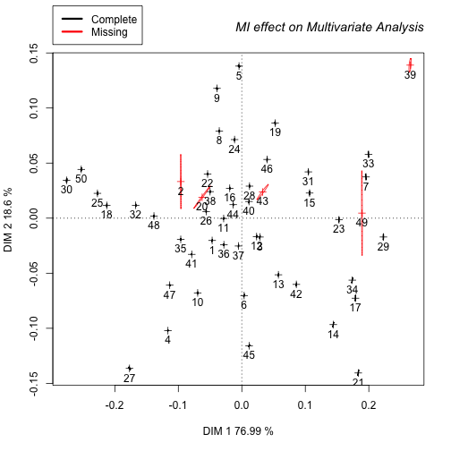

***


This tutorial is the same as the one given in the Supplementary Material S2 in Clavel et al. (2014). We also provide a worked example on a simulated dataset.

Simplified tutorial for the use of Multiple Imputation (MI) techniques used in Clavel et al. (2014)
==

The following R functions requires the "missMDA", "mice", "Amelia", "NORM", and "Hmisc" packages (See Material & Methods - Clavel et al.(2014)).


```r
# Required packages
library(mice)
library(Amelia)
library(Hmisc)
library(missMDA)
library(norm)

# Load the dataset
data<-read.table("mydata.txt", sep="\t", dec=".", header=T)

# alternatively you can try the following function:
# data <- read.table(file.choose(), sep="\t", dec=".", header=T)

# Number of multiple imputations
m=20

# ---------------- Imputation of the dataset ---------------- #
#          just select one of these methods below             #
# ------------------------------------------------------------#

# Mice – Method = "pmm" (predictive mean matching) or "norm"
imp <-   mice(data,  m  =  m, method="pmm")

# MI-PCA – ncp = number of dimensions to use for the imputation process
imp <-  MIPCA(data,  ncp  =  2,  scale  =  TRUE,  method  =  "Regularized",  nboot  = m)

# Hmisc – (type= "pmm" or "regression") A,B,C,D,E are the data colnames
imp<-aregImpute(~A+B+C+D+E,data,n.impute=m,type="pmm",match="weighted")

# Amelia II
imp<-  amelia(data, m  =  m)

# Norm
data<-as.matrix(data)
preA <- prelim.norm(data)
datA <- em.norm(preA) #find the MLE for a starting value
rd<-trunc(1000000*runif(1) + 10)
rngseed(rd)
imp<-list()

  for (i in 1:m){
    impA <- da.norm(preA,datA,steps=50,showits=FALSE) # take 50 steps
    imp[[i]] <- data.frame(imp.norm(preA,impA,data))
  }
```


agglomerate.data & plot.MI functions
==

Based on m (>1) datasets imputed using a multiple imputation technique, the two following R functions average the m imputed datasets and display the 95% confidence ellipses associated to each specimen. The function to draw confidence ellipses is based on the R function “ELLI” proposed by Claude (2008). The following R functions requires the "missMDA", "mice", "Amelia", "NORM", "Hmisc" and "shapes" packages (See Material & Methods).

Combination of the results obtained with one of the MI methods (Mice, Amelia, Norm, MI-PCA, or Hmisc; see the "simplified tutorial above") is done using the "agglomerate.data" function. This function generates an averaged dataset (_agglomerate.data\$ImpM_), and a list with the m imputed datasets (_agglomerate.data\$Mi_).

**Example:**


```r
IM<-agglomerate.data(data=data, imp=imp, Mimp=20, Method="mice")
```


Where "data" is the dataset with the missing values, "imp" is the MI dataset object obtained with one of the MI methods (see above), "Mimp" is the number of MI, and "Method" is one of the methods described above ("mice", "norm", "hmisc", "missmda" or "amelia").


```r
plot.MI(IM, symmetric=TRUE, DIM=c(1,2), web=FALSE, ellipses=TRUE)
```

The "plot.MI" function allows the procrustes superimposition of the m imputed datasets onto the principal components calculated from the average MI-dataset. Symmetric = whether or not the matrices must be scaled to have unit sum of square. DIM = the dimensions to display on the biplot; web = whether or not the m imputed points for each specimen are linked to their related average MI-dataset points; ellipses = whether or not the 95% confidence ellipses around each specimen is drawn.

A worked example
==


We use a simulated example to illustrate how the method works:


```r
library(MASS)
# Just make a random dataset
set.seed(100)

# Simulate correlated traits
p=5; n=50
# covariance matrix
sigma <- t(matrix(value <- rnorm(p*p),p,p))%*%matrix(value,p,p) 
data <- mvrnorm(n, mu=rep(0,p), Sigma=sigma)
colnames(data) <- c("A","B","C","D","E")

# Introduce some, say 5, "NA" values
data[sample(1:(p*n), 5)] <- NA
```

Now we try to impute the missing cases using the _mice_ function with the "pmm" model (predictive mean matching).


```r
# First source the codes provided in the Supplementary Material S2 
# source("agglomerate_and_plot.r")

library(mice)
m = 50 # number of multiple imputations
imp <- mice(data,  m  =  m, method="pmm", print=FALSE)

# Combine the results
IM <- agglomerate.data(data=data, imp=imp, Mimp=m, Method="mice")

# Compare the dataset with NA to the averaged imputed dataset:
head(data)
```

```
##               A          B           C          D          E
## [1,]  0.4032751  0.6295408  0.33471202  0.8579600 -1.2022011
## [2,]  0.3160193         NA  0.50713482  2.3998178 -0.6580553
## [3,]  0.3733410  0.6170655 -0.46437551 -0.5160806  0.7105557
## [4,] -2.0835367  1.2136891 -0.90942279  2.2168803 -1.7767234
## [5,]  1.4039887 -3.0862928  0.54825358  0.7598991  1.3378934
## [6,] -0.5938399  1.3263972 -0.05304454 -0.4477766 -0.7683018
```

```r
head(IM$ImpM)
```

```
##               A          B           C          D          E
## [1,]  0.4032751  0.6295408  0.33471202  0.8579600 -1.2022011
## [2,]  0.3160193 -0.6691498  0.50713482  2.3998178 -0.6580553
## [3,]  0.3733410  0.6170655 -0.46437551 -0.5160806  0.7105557
## [4,] -2.0835367  1.2136891 -0.90942279  2.2168803 -1.7767234
## [5,]  1.4039887 -3.0862928  0.54825358  0.7598991  1.3378934
## [6,] -0.5938399  1.3263972 -0.05304454 -0.4477766 -0.7683018
```

```r
# Plot the MI datasets axis
plot.MI(IM, symmetric=TRUE, DIM=c(1,2), web=FALSE, ellipses=TRUE)
```




References
==

**Claude J. 2008**. Morphometrics with R. New York: Springer 

**Clavel J., Merceron G., Escarguel G. 2014**. Missing Data Estimation in Morphometrics: How Much is Too Much? Syst. Biol. 63:203-218.


